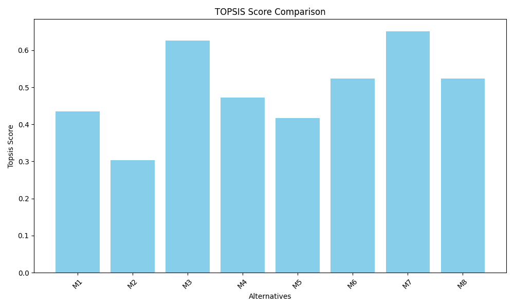
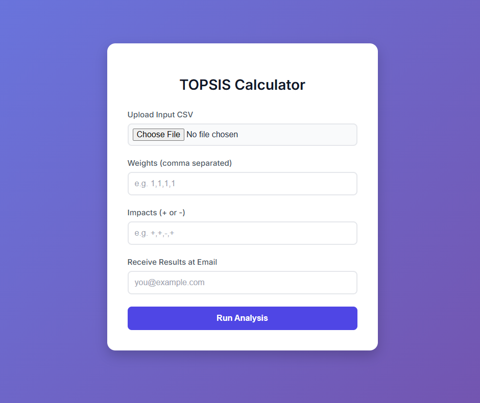

# TOPSIS Implementation Project

This repository contains the solution for the **TOPSIS (Technique for Order of Preference by Similarity to Ideal Solution)** assignment, covering a CLI tool, a Python Library, and a Web Service.

## 📚 Project Overview

The project is divided into three parts:

1.  **Part-I**: Command Line Interface (CLI) for TOPSIS.
2.  **Part-II**: A distributable Python Package uploaded to PyPI.
3.  **Part-III**: A hosted Web Service with email functionality.

---

## 🚀 Part 1: TOPSIS CLI

A Python script to perform TOPSIS analysis on a CSV file.

### Usage
```bash
python topsis.py <InputDataFile> <Weights> <Impacts> <ResultFileName>
```

**Example:**
```bash
python topsis.py data.csv "1,1,1,1,1" "+,+,+,+,+" result.csv
```

## 🧠 Methodology

The TOPSIS algorithm works as follows:

1.  **Normalization**: Convert the decision matrix into a normalized decision matrix.
2.  **Weighting**: Multiply by the assigned weights for each criterion.
3.  **Ideal Values**: Identify the ideal best ($V^+$) and ideal worst ($V^-$) values.
4.  **Separation Measures**: Calculate the Euclidean distance of each alternative from the ideal best ($S^+$) and ideal worst ($S^-$).
5.  **Performance Score**: Calculate $P_i = S^-_i / (S^+_i + S^-_i)$.
6.  **Ranking**: Rank alternatives based on the score (higher is better).

---

## 📊 Results

### Sample Output
The following results were generated using the input `data.csv`.

| Fund Name | P1 | P2 | P3 | P4 | P5 | Topsis Score | Rank |
| :--- | :--- | :--- | :--- | :--- | :--- | :--- | :--- |
| M7 | 0.79 | 0.62 | 4.8 | 59.2 | 16.35 | 0.6513 | 1 |
| M3 | 0.82 | 0.67 | 3.8 | 63.1 | 17.1 | 0.6268 | 2 |
| M8 | 0.84 | 0.71 | 6.5 | 34.5 | 10.64 | 0.5236 | 3 |
| M6 | 0.69 | 0.48 | 6.6 | 48.7 | 14.12 | 0.5234 | 4 |
| M4 | 0.6 | 0.36 | 3.5 | 69.2 | 18.42 | 0.4729 | 5 |

### Visual Analysis


### Web Interface
> 

---

## 📦 Part 2: Python Package

The TOPSIS logic is packaged and available on PyPI.

-   **Package Name**: `Topsis-Hardik-102303945`
-   **PyPI Link**: [Topsis-Hardik-102303945](https://pypi.org/project/Topsis-Hardik-102303945/)

### Installation
```bash
pip install Topsis-Hardik-102303945
```

### Usage
```bash
topsis data.csv "1,1,1,1,1" "+,+,+,+,+" result.csv
```

---

## 🌐 Part 3: Web Service

A Flask-based web application allows users to upload their data and receive results via email.

-   **Live Demo**: [Click Here](https://topsis-khaki.vercel.app/)
-   **Features**:
    -   Upload CSV files.
    -   Input weights and impacts.
    -   Results sent directly to your email.

### Running Locally

1.  Navigate to the web service directory:
    ```bash
    cd 102303945-Web-Service
    ```
2.  Install dependencies:
    ```bash
    pip install -r requirements.txt
    ```
3.  Set up environment variables in `.env`:
    ```env
    SENDER_EMAIL=your_email@gmail.com
    SENDER_PASSWORD=your_app_password
    ```
4.  Run the app:
    ```bash
    python app.py
    ```

---

## 🛠️ Technologies Used
-   Python 3
-   Pandas & NumPy
-   Flask (Web Framework)
-   SMTP (Email Service)
-   Vercel (Deployment)

## 👤 Author
**Hardik**  
Roll No: 102303945
