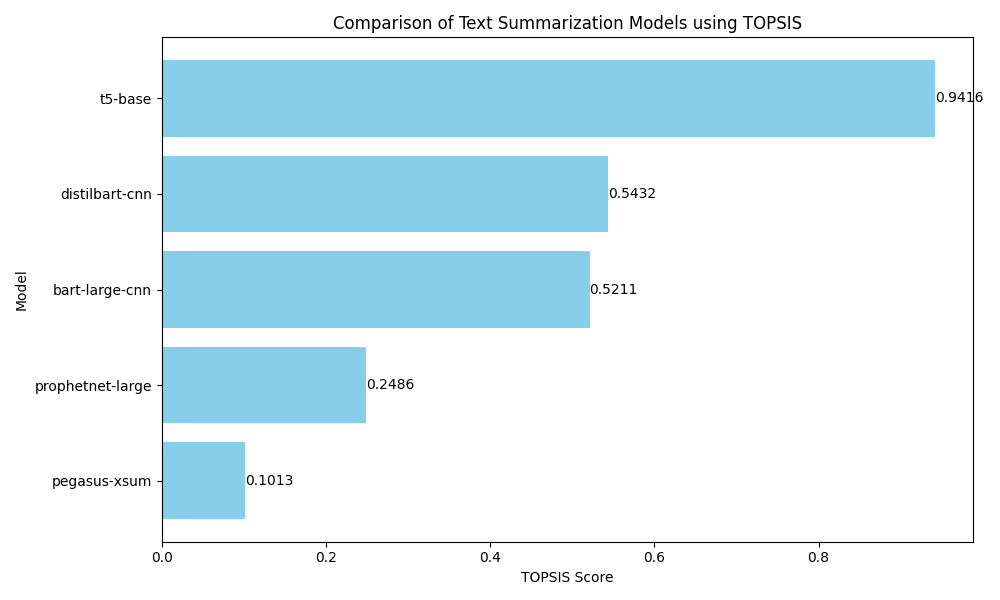

# TOPSIS for Text Summarization Models

This project applies the **TOPSIS (Technique for Order of Preference by Similarity to Ideal Solution)** method to find the best pre-trained model for **Text Summarization**.

**Roll Number**: 102303945  
**Task**: Text Summarization (Roll Numbers ending with 0 or 5)

## 🧠 Models & Metrics

We compared 5 popular pre-trained models using the following criteria:

| Model | ROUGE-L | Size (MB) | Inference Time (s) | Downloads (M) |
| :--- | :--- | :--- | :--- | :--- |
| **t5-base** | 0.45 | 890 | 1.2 | 5.0 |
| **bart-large-cnn** | 0.44 | 1600 | 1.8 | 3.0 |
| **pegasus-xsum** | 0.47 | 2200 | 2.5 | 1.0 |
| **prophetnet-large** | 0.42 | 1500 | 1.9 | 0.5 |
| **distilbart-cnn** | 0.43 | 1000 | 1.0 | 2.0 |

### Metrics Explanation
- **ROUGE-L** (+): Higher is better. Measures summary quality.
- **Model Size** (-): Lower is better. Preferred for deployment.
- **Inference Time** (-): Lower is better. Preferred for real-time applications.
- **Downloads** (+): Higher is better. Indicates community trust/stability.

## 📊 Results

The TOPSIS algorithm ranked the models as follows:

| Rank | Model | TOPSIS Score |
| :--- | :--- | :--- |
| **1** | **t5-base** | **0.9416** |
| 2 | distilbart-cnn | 0.5432 |
| 3 | bart-large-cnn | 0.5211 |
| 4 | prophetnet-large | 0.2486 |
| 5 | pegasus-xsum | 0.1013 |

### Visualization

## 📝 Analysis
- **t5-base** emerged as the best model due to a great balance of high download count, reasonable size, and good ROUGE score.
- **pegasus-xsum**, despite having the highest ROUGE-L score, suffered heavily due to its massive size (2.2GB) and slow inference time, placing it last.
- **distilbart-cnn** is a strong runner-up, offering the fastest inference time, making it ideal for latency-sensitive applications.
